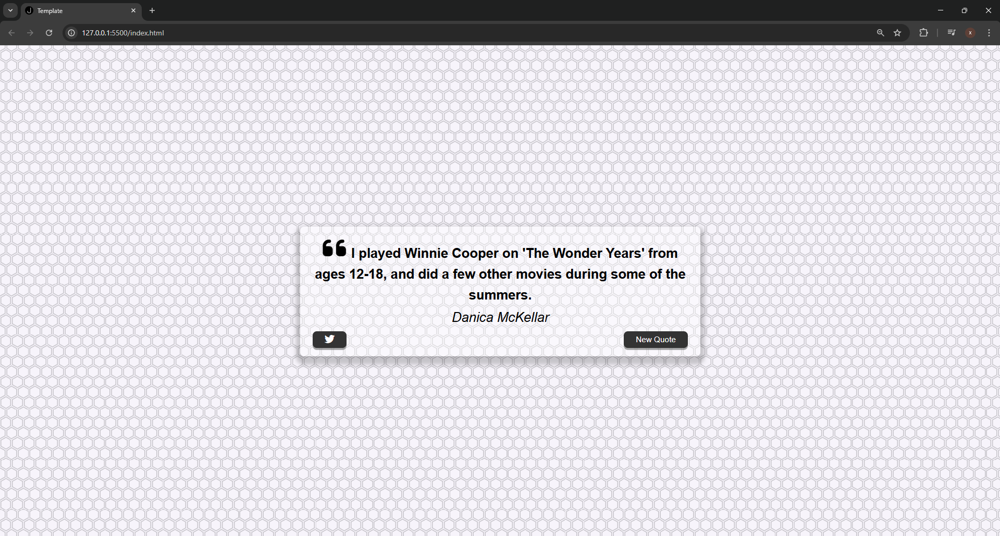

# QuoteGenerator

 <!-- Add a screenshot if available -->

A web application that fetches inspirational quotes from an API and displays random quotes with their authors. Includes functionality to tweet the current quote.

## Features

- Fetches quotes from [Quotes API](https://jacintodesign.github.io/quotes-api/data/quotes.json)
- Displays random quotes with author attribution
- Automatically falls back to local quotes if API fails
- Responsive design that works on all devices
- Tweet button that:
  - Pre-populates a tweet with the current quote and author
  - Opens Twitter (X) in a new tab
  - Uses proper Twitter Web Intent syntax
- Loading spinner during API fetch
- Smart quote length detection (applies different styling for long quotes)

## Technologies Used

- HTML5
- CSS3 (with Flexbox)
- JavaScript (ES6+)
- Fetch API for asynchronous data loading
- Twitter Web Intent API

## Installation & Usage

No installation required - runs directly in the browser:

1. Clone this repository or download the files
2. Open `index.html` in any modern browser
3. Click "New Quote" button to get random quotes
4. Click Twitter icon to share the current quote

## API Reference

The application uses the free public API from:
https://jacintodesign.github.io/quotes-api/data/quotes.json

Sample quote object:
```json
{
  "text": "The greatest glory in living lies not in never falling, but in rising every time we fall.",
  "author": "Nelson Mandela"
}

